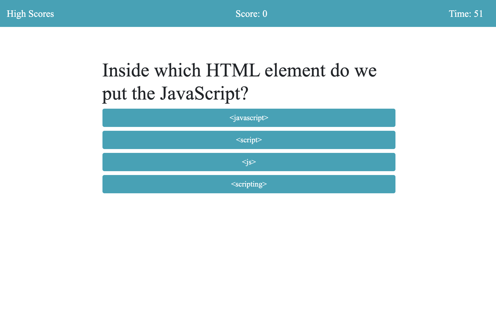

# Quiz-Game-Race-Against-Time
## Link to Random Password Generator
https://haywah27.github.io/Race-Against-Time-Quiz-Game/

This application is a timed coding quiz with multiple-choice questions about JavaScript. It also has the ability to store list of high scores.

# Deployed Portfolio Website Image

# Demo

# Summary of changes
* Linking CSS and JS pages
* Adding timer
* Adding game message function
* Linking style through bootstrap
* Adding start page button
* Adding start page game instructions
* Updating start page id tags to be more specific
* Creating a countdown clock
* Adding answer button attributes
* Developing functionality for answer buttons
* Cleaning up unused code
* Clearing content in endGame function 
* Adding reactive score tally
* Hiding submission box until end of game screen
* Adding navigation to highscores html page
* Developing local storage display on highscores page
* Commenting on code
* Added navbar
* Moving score and timer to display in navbar
* Adding style elements

